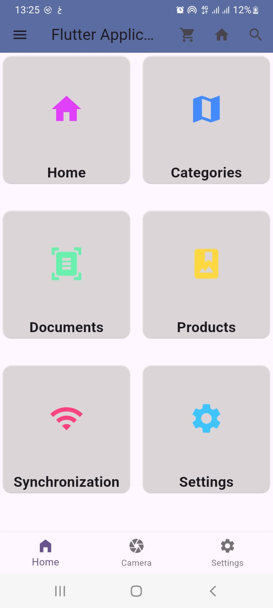
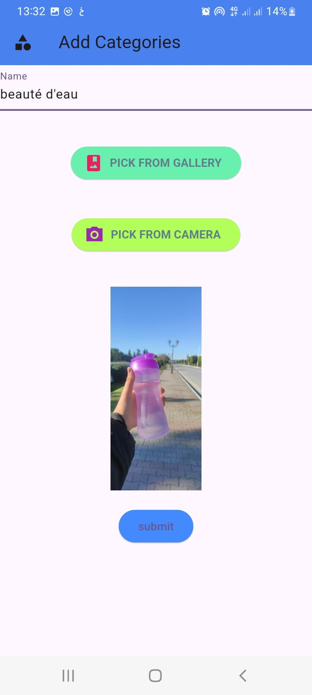
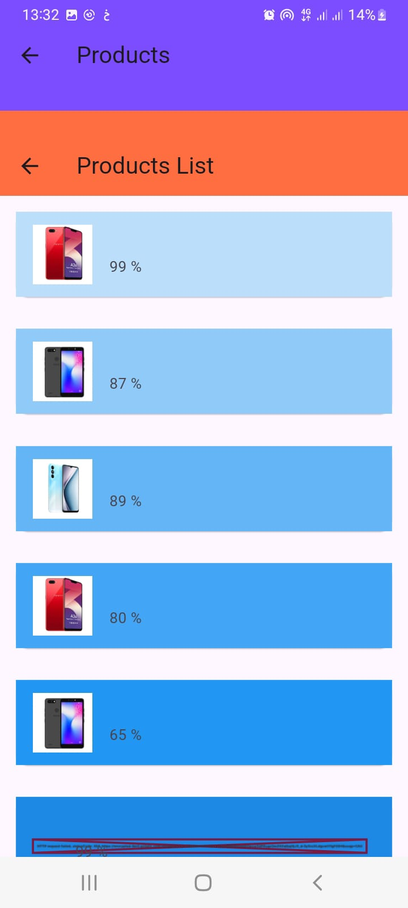

# CategoryMarketApp - Flutter Application

Welcome to **CategoryMarketApp**, a Flutter-based application designed to simplify category and market management. Explore its features below with detailed screenshots showcasing the app's functionality and user experience.

---

## 🔥 Features:
- User authentication and profile management.
- Dynamic home page displaying products and categories.
- Shopping cart functionality to calculate totals and manage items.
- Add categories and products seamlessly.
- Intuitive product list for easy navigation.

---

## 📸 App Screenshots

### 1️⃣ **User Profile**

The **User Profile** screen displays your personal information and profile picture for a personalized experience.

---

### 2️⃣ **Home Page**

The **Home Page** offers a dynamic view of all available categories and products, making it easy to explore.

---

### 3️⃣ **Login Page**

The **Login Page** ensures secure access to your account with a sleek and user-friendly design.

---

### 4️⃣ **My Cart**

The **Cart** screen allows you to:
- View items added to your cart.
- Calculate the total cost.
- Add or remove products as needed.

---

### 5️⃣ **Add Categories**

Easily **Add Categories** with this feature, helping you organize your products efficiently.

---

### 6️⃣ **Add Products to Cart**

Browse through **Products** and add them directly to your cart for a seamless shopping experience.

---

### 7️⃣ **Product List**

View the comprehensive **Product List** to select and manage items quickly and efficiently.

---

## 🚀 About the App
This application is built using Flutter and is designed for managing categories and products effectively. Whether you're looking to explore products, manage your cart, or add new items, **CategoryMarketApp** has you covered!

---

## 🤝 Contributing
Contributions are welcome! If you have ideas to improve the app or find issues, feel free to open an issue or submit a pull request.

---

## 📬 Contact
If you have any questions or feedback, feel free to reach out.

---

Thank you for checking out **CategoryMarketApp**! We hope you enjoy using it. 🎉
